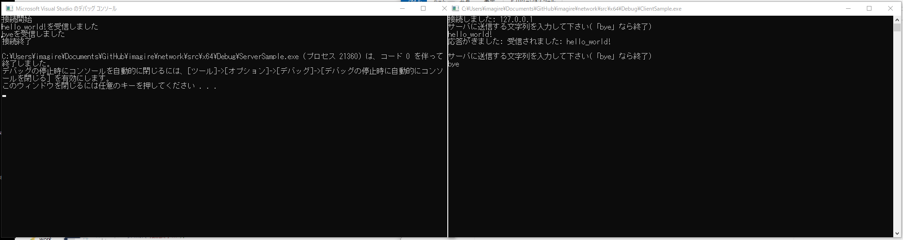

# はじめに
ソケット通信を勉強するための簡単なサンプルです。

# お題
ソリューションでは、2つのexeを作ります。一つはサーバープログラムで、もう一つはサーバープログラムと通信をするクライアントプログラムです。最初にサーバープログラムを立ち上げて、次にクライアントプログラムを立ち上げます。クライアントプログラムから入力を行うと、サーバープログラムで受け取り、返信をします。

とこが、まだクライアントプログラムはできていなくて、ビルドが通りません。

プログラㇺを完成させてください。

# 方法
本リポジトリをフォークして、プログラムを修正して動くようにしてください。
完成したら、ソースコードをコミットして、プルリクエストを投げてください。
